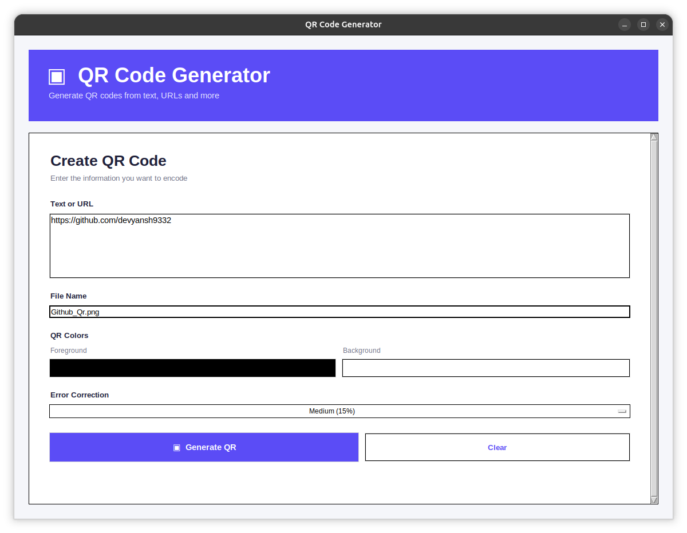

# 🔲 QR Code Generator

A lightweight, cross-platform QR Code Generator built with Python and Tkinter.

Generate QR codes from text, URLs, and other information with customizable colors, error correction, responsive previews, and simple save and folder-opening options.

---

## ✨ Features

- Generate QR codes from text or URLs
- Clean graphical interface using Tkinter
- Custom foreground and background colors
- Four QR error-correction levels
- Responsive QR code preview
- QR preview shown only after generation
- Save QR codes as PNG or JPEG
- Automatic `.png` extension when no image extension is provided
- Open the folder containing the saved QR code
- Back button to return to the generator
- Clear form functionality
- Automatic virtual environment setup
- Automatic dependency installation
- Cross-platform support for Linux, Windows, and macOS

---

## 🖥️ Application Workflow

```text
Start Application
       │
       ▼
┌─────────────────────────┐
│    Generator Screen     │
│                         │
│  Text / URL             │
│  File Name              │
│  QR Colors              │
│  Error Correction       │
│                         │
│  [ Generate QR ]        │
│  [ Clear ]              │
└────────────┬────────────┘
             │
             ▼
        Generate QR
             │
             ▼
┌─────────────────────────┐
│     QR Preview Screen   │
│                         │
│         QR CODE         │
│                         │
│  [ Save QR ]            │
│  [ Open Folder ]        │
│  [ ← Back ]             │
└─────────────────────────┘
```

---

## 🖼️ Screenshots

### Generator Screen

The main screen allows users to enter text or a URL, choose a filename, customize QR colors, select error correction, and generate the QR code.



### QR Preview Screen

After generating the QR code, the application displays it in a dedicated preview screen with options to save the QR code, open its folder, or return to the generator.


---

## 🎨 QR Code Customization

### Foreground Color

Controls the color of the QR code.

Default:

```text
Black
```

### Background Color

Controls the QR code background.

Default:

```text
White
```

### Error Correction

| Level | Recovery Capacity |
|-------|------------------:|
| Low | 7% |
| Medium | 15% |
| Quartile | 25% |
| High | 30% |

---

## 📱 Responsive QR Preview

The QR preview automatically adjusts its size according to the available application window.

```text
Small Window
     ↓
Smaller QR Code

Large Window
     ↓
Larger QR Code
```

---

## 💾 Saving QR Codes

Generated QR codes can be saved using the **Save QR** button.

Supported formats:

```text
PNG
JPEG
```

Example:

```text
GitHub_QR.png
```

If a filename is entered without an image extension, `.png` is automatically added.

---

## 📁 Open Folder

After saving a QR code, the **Open Folder** button opens the directory containing the saved file.

The application detects the operating system automatically.

### Windows

Uses Windows File Explorer.

### macOS

Uses the macOS `open` command.

### Linux

Uses the `xdg-open` command.

---

## 🛡️ Automatic Environment Setup

The application automatically manages its Python environment.

On startup it:

1. Checks whether a virtual environment exists.
2. Creates `.venv` when required.
3. Restarts using the virtual environment.
4. Checks for required packages.
5. Installs missing packages.
6. Starts the application.

---

## 📦 Dependencies

- Python 3
- Tkinter
- qrcode
- Pillow

The main Python dependency is:

```text
qrcode[pil]
```

---

# 🐧 Linux

## Ubuntu / Debian

```bash
sudo apt update
sudo apt install python3 python3-venv python3-tk -y
```

Clone the repository:

```bash
git clone git@github.com:devyansh9332/qr-code-generator.git
cd qr-code-generator
python3 qr_generator.py
```

---

## Fedora

```bash
sudo dnf install python3 python3-tkinter -y
```

Clone and run:

```bash
git clone git@github.com:devyansh9332/qr-code-generator.git
cd qr-code-generator
python3 qr_generator.py
```

---

# 🪟 Windows

## 1. Install Python

Install Python 3 and enable **Add Python to PATH** during installation.

## 2. Clone the Repository

Using SSH:

```bash
git clone git@github.com:devyansh9332/qr-code-generator.git
```

Or HTTPS:

```bash
git clone https://github.com/devyansh9332/qr-code-generator.git
```

Enter the project:

```bash
cd qr-code-generator
```

Run:

```bash
python qr_generator.py
```

The application automatically creates the virtual environment and installs the required Python packages.

---

# 🍎 macOS

Install Python using Homebrew:

```bash
brew install python
```

Clone and run:

```bash
git clone git@github.com:devyansh9332/qr-code-generator.git
cd qr-code-generator
python3 qr_generator.py
```

---

# 🚀 Quick Start

### Linux / macOS

```bash
git clone git@github.com:devyansh9332/qr-code-generator.git
cd qr-code-generator
python3 qr_generator.py
```

### Windows

```bash
git clone git@github.com:devyansh9332/qr-code-generator.git
cd qr-code-generator
python qr_generator.py
```

---

# 🧑‍💻 Manual Installation

## Linux / macOS

```bash
python3 -m venv .venv
source .venv/bin/activate
python -m pip install -r requirements.txt
python qr_generator.py
```

## Windows

```powershell
python -m venv .venv
.venv\Scripts\activate
python -m pip install -r requirements.txt
python qr_generator.py
```

---

# 📂 Project Structure

```text
qr-code-generator/
│
├── qr_generator.py
├── requirements.txt
├── README.md
├── .gitignore
│
└── screenshots/
    ├── generator-screen.png
    └── qr-preview.png
```

The `.venv/` directory is created automatically and should not be committed to the repository.

---

# 📄 requirements.txt

```text
qrcode[pil]
```

Install dependencies with:

```bash
python -m pip install -r requirements.txt
```

---

# 🛠️ Technologies Used

- Python 3
- Tkinter
- qrcode
- Pillow
- pathlib
- subprocess
- platform
- os
- Git

---

# 🧠 Concepts Demonstrated

- Object-oriented programming
- Classes and methods
- Functions
- Conditional statements
- Exception handling
- File handling
- Directory handling
- Path management
- Virtual environment management
- Package installation
- GUI development
- Tkinter widgets
- Event handling
- Color selection
- Image processing
- QR code generation
- Dynamic image resizing
- Operating-system detection
- Cross-platform commands
- Subprocess execution
- User input validation

---

# 🔐 Error Handling

The application handles common situations including:

- Missing Python packages
- Virtual environment creation failures
- Missing Tkinter
- Invalid QR generation
- Empty input
- Failed QR saving
- Failed folder opening
- Unsupported environment configuration

Users receive appropriate graphical messages when an operation cannot be completed.

---

# 🔄 Example Usage

Enter:

```text
https://github.com/devyansh9332
```

Choose a filename:

```text
GitHub_QR.png
```

Customize:

```text
Foreground Color
Background Color
Error Correction
```

Click:

```text
Generate QR
```

The QR preview screen opens.

Available actions:

```text
← Back
Save QR
Open Folder
```

---

# 🔮 Future Improvements

- QR code history
- Copy QR image to clipboard
- Drag-and-drop support
- Batch QR generation
- Wi-Fi QR generation
- Contact/vCard QR generation
- Email QR generation
- SMS QR generation
- Phone number QR generation
- Custom QR borders
- QR logo support
- QR templates
- Dark/light application themes
- Keyboard shortcuts
- Recent QR codes
- QR code sharing
- Custom output directory
- Standalone executable builds

---

# ⚠️ Notes

- Tkinter is required for the graphical interface.
- An internet connection may be required during the first run to install missing Python packages.
- Generated QR images are saved only when the **Save QR** option is used.
- The `.venv/` directory should not be committed to the repository.

---

# 👨‍💻 Author

**SudoTerminal**

---

# 📜 License

This project is open source and available for personal and educational use.
